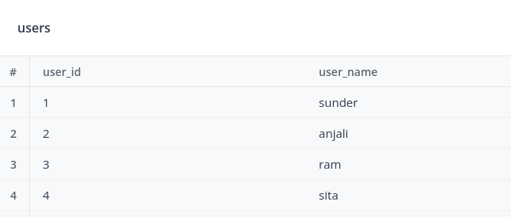
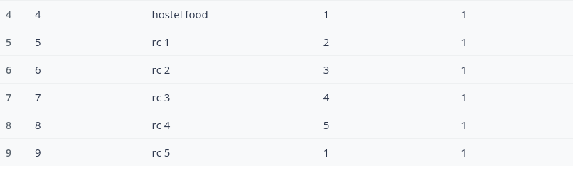

# TICKET_SYSTEM
# Round Robin Ticket Assignment

This is an example of a simple Round Robin algorithm for ticket assignment in Python.

## Visualization

Below are the users whom the tickets can be assigned

The tickets table is hown below

the website is hosted in render in below link
[visit](https://test-app-f9xn.onrender.com/)
1. The database is hosted in neon
2. user id = 1 password = qwerty.
3. after login raise the tickets.
